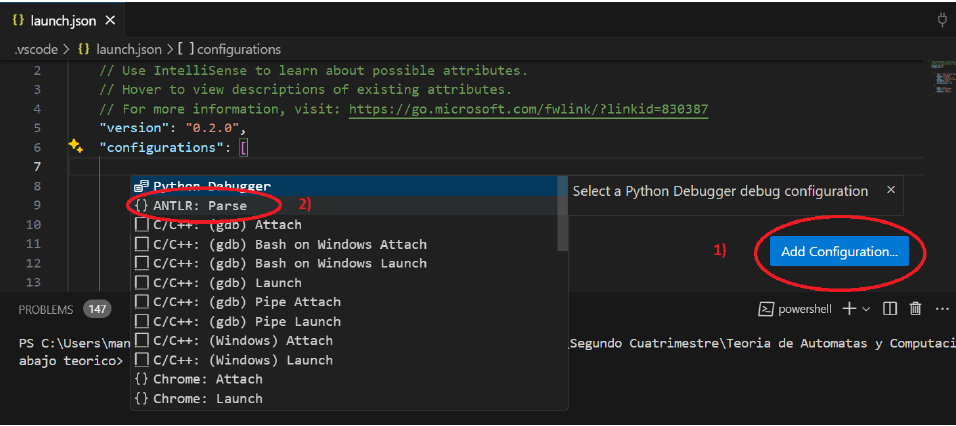
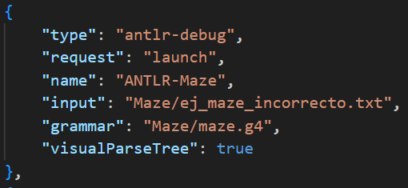
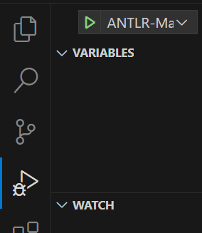

## Uso de la herramienta ANTLR

En este documento recogeremos todo lo necesario para poder utilizar la herramienta ANTLR y probar nuestra gramatica.

### Instalación de ANTLR (en VSCode)
- Tenemos que instalar la extensión de ANTLR4 en VSCode "ANTLR4 grammar syntax support".
- Instalamos ANTLR4 en nuestro sistema (en powershell).
``` pip install antlr4-tools ```
- Tenemos que añadir una configuración para poder ejecutar ANTLR4 en nuestro sistema.
Se te abrirá un archivo llamado "launch.json" y le damos a "Add Configuration".
    <div style="text-align: center;">
    
    </div>

    Se generará una nueva entrada en el archivo con el siguiente formato:

    <div style="text-align: center;">
    
    </div>

    Donde en input pondriamos la ruta de nuestro archivo.txt y en grammar la ruta de nuestra gramatica .g4.

    Una vez hecho la configuración, podemos ir a la opcion de "Run and Debug" y seleccionar la configuración que hemos creado.

    <div style="text-align: center;">
    
    </div>

<br>

### Ejecución a través de la terminal

#### Instalación y requisitos previos

En este tutorial se utilizará un sistema Linux basado en Arch, por lo que los pasos de instalación pueden variar si usas otro sistema operativo.

**Paso 1:** Instalar Java, que es necesario para ejecutar ANTLR4.

```bash
sudo pacman -S jdk-openjdk
```

**Paso 2:** Instalar ANTLR4

Descarga el archivo `.jar` de ANTLR4 desde el sitio oficial:

```bash
wget https://www.antlr.org/download/antlr-4.13.0-complete.jar
```

Una vez descargado, mueve el archivo a un directorio accesible, por ejemplo `/usr/local/lib`:

```bash
sudo mv antlr-4.13.0-complete.jar /usr/local/lib/
```

**Paso 3:** Crear alias para facilitar el uso de ANTLR4 desde la terminal

- Abre tu archivo de configuración del shell (`~/.bashrc`, `~/.zshrc`, etc.).
- Agrega las siguientes líneas:

```bash
alias antlr4='java -Xmx500M -cp "/usr/local/lib/antlr-4.13.0-complete.jar:$CLASSPATH" org.antlr.v4.Tool'
alias grun='java -Xmx500M -cp "/usr/local/lib/antlr-4.13.0-complete.jar:$CLASSPATH" org.antlr.v4.gui.TestRig'
alias antlr-javac='javac -cp ".:/usr/local/lib/antlr-4.13.0-complete.jar"'
alias antlr-java='java -cp ".:/usr/local/lib/antlr-4.13.0-complete.jar"'
```

**Paso 4:** Recargar la configuración del shell

```bash
source ~/.bashrc
```

#### Ejecución

Una vez que tienes la gramática definida, necesitas crear una clase `Main` que te permita ejecutar el análisis. A continuación se muestra un ejemplo de clase `Main` en Java:

```java
import org.antlr.v4.runtime.*;
import org.antlr.v4.runtime.tree.*;

import java.io.FileInputStream;
import java.io.InputStream;

public class Main {
    public static void main(String[] args) throws Exception {
        // Verifica que se haya pasado un archivo como argumento
        if (args.length < 1) {
            System.err.println("Por favor, especifica el archivo de entrada.");
            return;
        }

        // Leer el archivo de entrada
        String fileName = args[0];
        InputStream inputStream = new FileInputStream(fileName);

        // Crear un objeto CharStream desde el archivo
        CharStream input = CharStreams.fromStream(inputStream);

        // Crear el lexer, parser y ejecutar el análisis
        mazeLexer lexer = new mazeLexer(input);
        CommonTokenStream tokens = new CommonTokenStream(lexer);
        mazeParser parser = new mazeParser(tokens);

        // Inicia el análisis desde la regla más alta definida (por ejemplo, 'program')
        ParseTree tree = parser.program();

        // Mostrar el árbol de análisis generado
        System.out.println(tree.toStringTree(parser));
    }
}
```

**Paso 5:** Generar el código ANTLR

```bash
antlr4 maze.g4
```

**Paso 6:** Compilar todos los archivos generados, incluyendo la clase `Main`:

```bash
javac -cp ".:/usr/local/lib/antlr-4.13.0-complete.jar" *.java
```

Alternativamente, también puedes compilar los archivos generados con ANTLR:

```bash
antlr4 *.java
```

**Paso 7:** Ejecutar el programa usando el alias de ANTLR o el archivo `.jar`:

```bash
java -cp ".:/usr/local/lib/antlr-4.13.0-complete.jar" Main ej_maze_incorrecto.txt
```

O bien, usando el alias `antlr-java`:

```bash
antlr-java Main ej_maze_incorrecto.txt
```